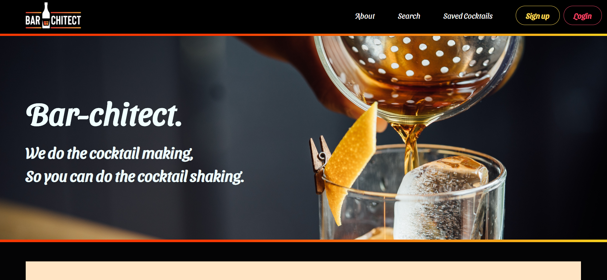
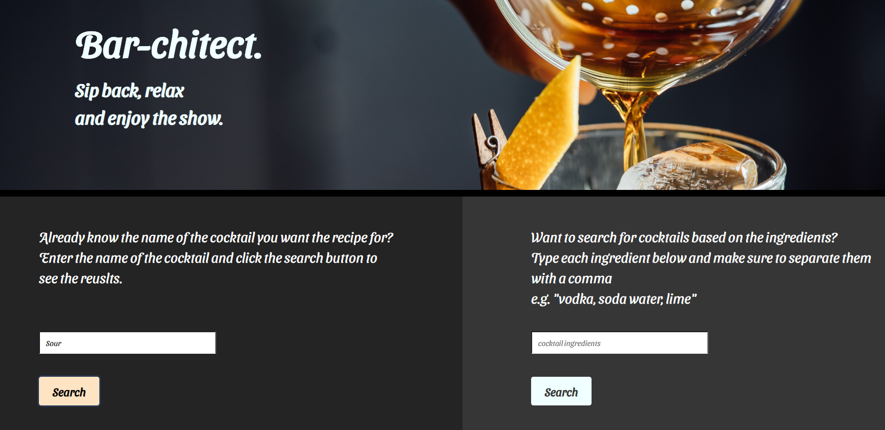
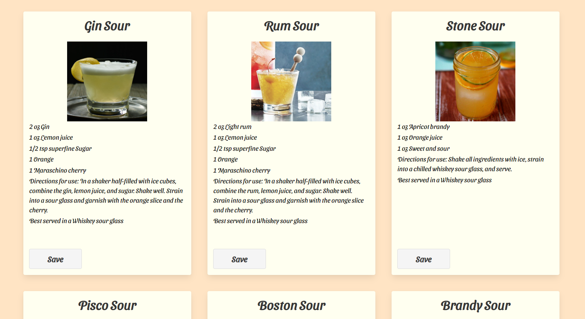

# Bar-chitect Cocktail Generator

## Description

Bar-chitect provides relevant cocktail recipe information using the Cocktaildb API. Users can search for cocktail recipes via two methods:

1. Search for cocktail recipe information via the cocktail name.
2. Search for cocktail recipe information via its ingredients.

Users will then be able to sign up/log in and save cocktail recipes so they can refer to them at a later date (W.I.P).

 

## Table of Contents

- [User Story](#User-Story)

- [Installation and Usage](#Installation-and-Usage)

- [Technologies Used](#Technologies-Used)

- [Future developments](#Future-developments)

- [Questions?](#questions)

- [License](#License)

 

## User Story

Given that I am interested in a particular cocktail recipe,

When i get to the search page and use the search by name function,

The recipe of the cocktail searched is rendered to the page.

 

Given that I am interested in what cocktails i can make with certain ingredients,

When I add ingredients into the search by ingredient function,

The recipes of cocktails with those ingredients are rendered to the page.

 

When I sign up as a user,

I can save the cocktails recipes I want so i can refer to them in the future.

 

 

## Installation and Usage

Access the application deployed to heroku via the link below:

OR

Clone the repository, open the terminal window and type

npm install in from the root folder followed by npm start.

 

## Technologies Used

<b>Languages</b>

- JavaScript
- HTML
- CSS
- JSX

<b>Libraries/Frameworks</b>

- Mongodb
- React
- Axios
- Google Fonts
- Font Awesome
- Bulma CSS

<b>API</b>

- Cocktaildb

 

## Future Developments

Saving cocktail data as per the registered user along with rendering that data to the saved cocktails page is currently a future development.

 

## Questions

GitHub: http://github.com/thomasmaglaris

Email: thomasmaglaris@gmail.com

 

## License

